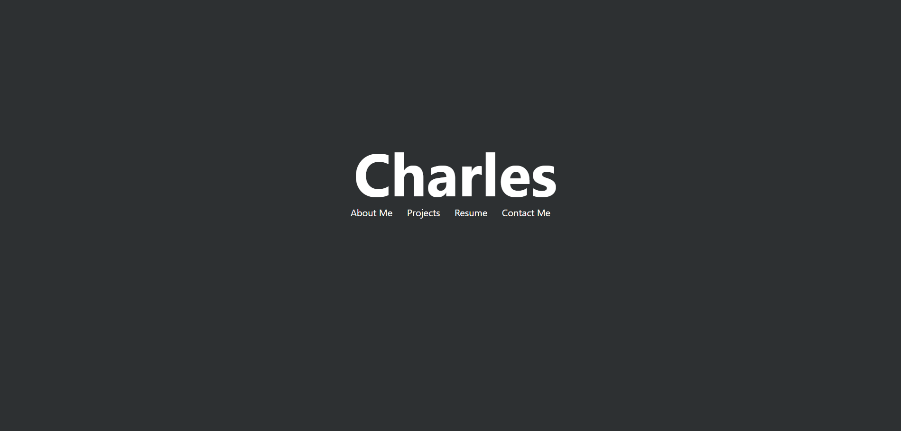
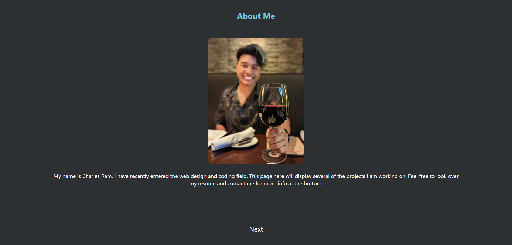
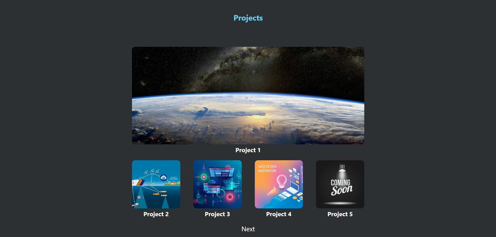

# Project Portfolio

## Description

This project was made to present my skills and projects I am working on as coder. The project uses simple HTML and CSS styling to display information about me and my projects.

## Usage

Just click on each section in the navigation bar to head to the desired section or click the next button to go through each one individually. Clicking the image will take you to the projects currently worked on. The bottom has contact and social links.

### Title Page

### About Me Page

### Projects Page

## Links
[GitHub](https://github.com/charles-ram/m2-project-portfolio)
[Launched-Site](https://charles-ram.github.io/m2-project-portfolio/)